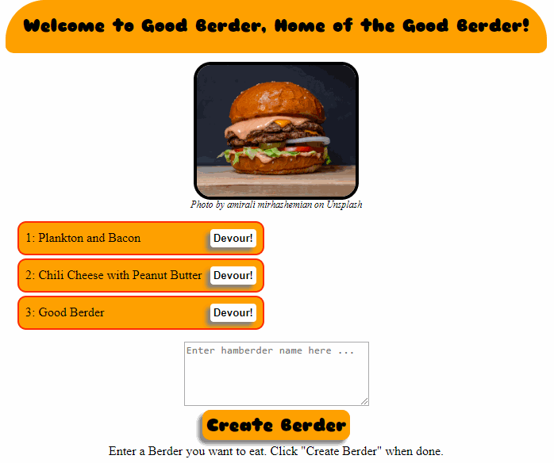

# Burger Server
Homework assignment where the goal is to create a burger logger with MySQL, Node, Express,and Sequelize. It's basically a to-do app.

## Description 
Web app allows you to write the name of a burger and save it. If you go back to the site the burgers will still be there. The saved burger is displayed on the screen above the text box where you name the burger. You can devour the burger by clicking the devour button next to the corresponding burger. The burger then moves to the right side of the screen and is made gray and italiced to indicate it has been devoured.

Every burger creation results in a post to the backend. The backend then creates a new row in the database. The backend generates html for displaying the burgers. When devour is clicked a put occurs, which results in the backend updating the corresponding row to indicate the burger was devoured. The HTML is regenerated giving the burger div a new class and removing the button.

## Deployed App
https://good-berder.herokuapp.com/

## Images
GIF demonstrating the Burger Server

## Installation 
Keep all files in a single folder and do not move files around within the folder. You must also have node.js and perform a npm install to bring in all the necessary node modules. Run application using server.js as your node starting point.

## Usage 
This was primarily made to meet the requirements of a homework assignment. It could be used as the basis for a to-do app.

## Credits 
I created this code based on the homework prompt created by Triology Education Services. Certain pieces of code I used online resources for help. I have included citations in the form of comments throughout the code. Image credits are located below the image.

## Contributing 
I was the only one to work on this project, but of course I had help from my instructor, TA's, and classmates.

## Challenges
Had a major issue with running the app on Heroku. Turned out to be due to changing the name of a column and only dropping the table on my dev database and not the table in JAWS database. The error when trying to run my code on Heroku was "Service Unavailable", which was very genertic. 

## License
[MIT](https://choosealicense.com/licenses/mit/)
